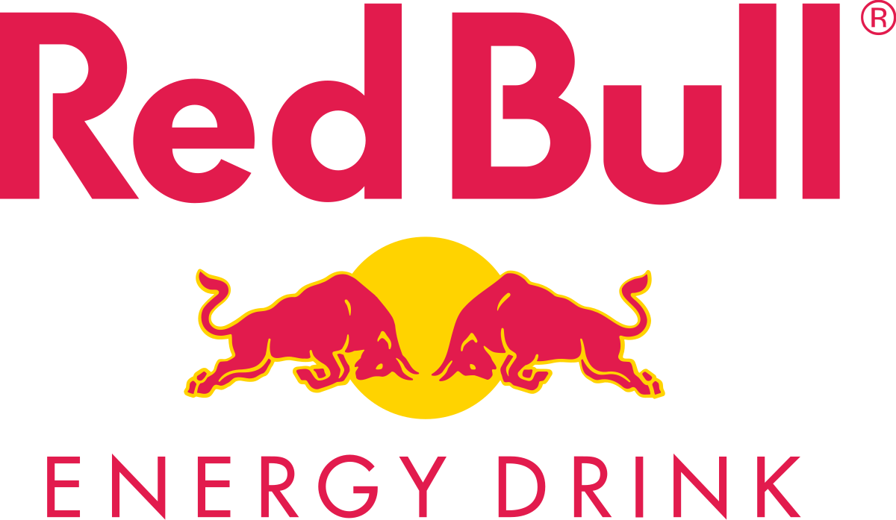
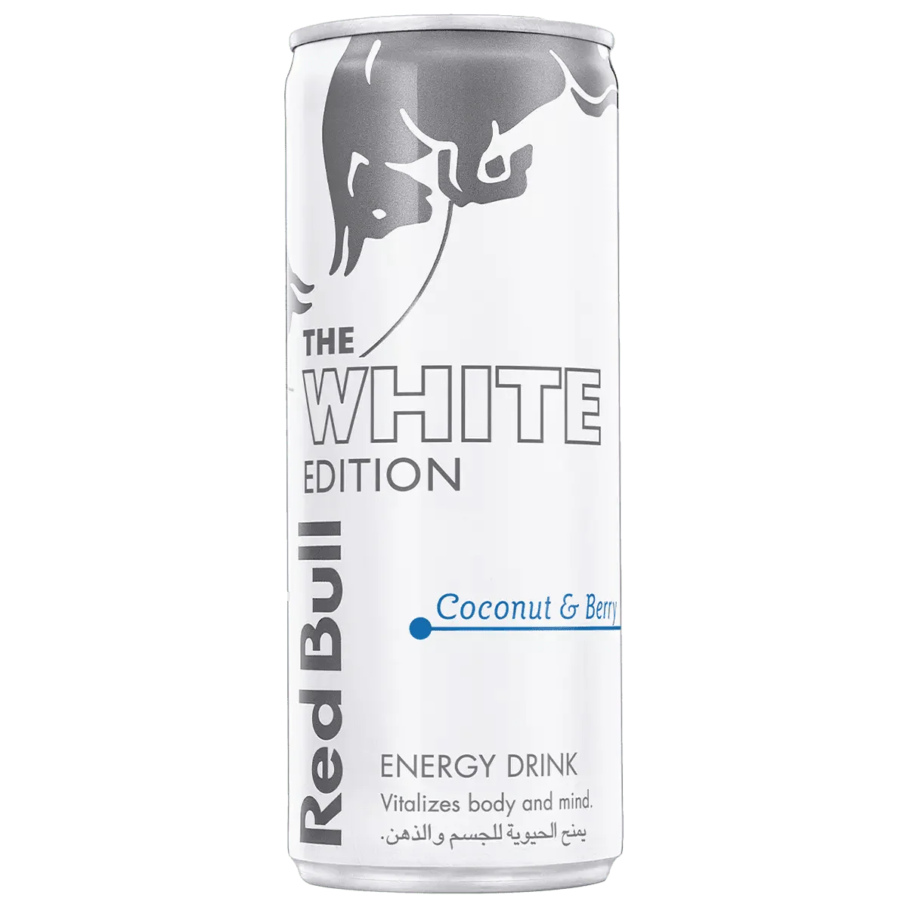
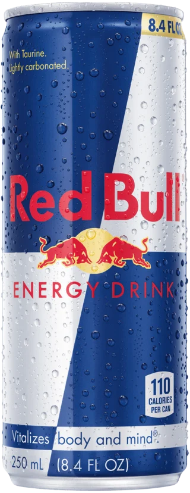
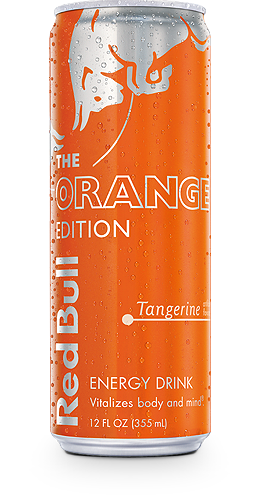
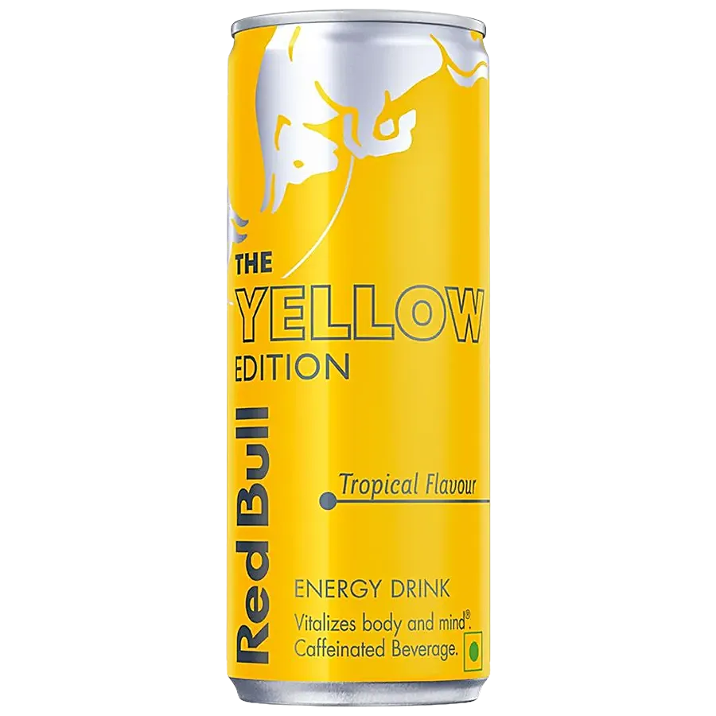
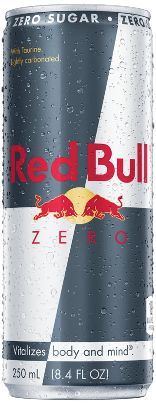
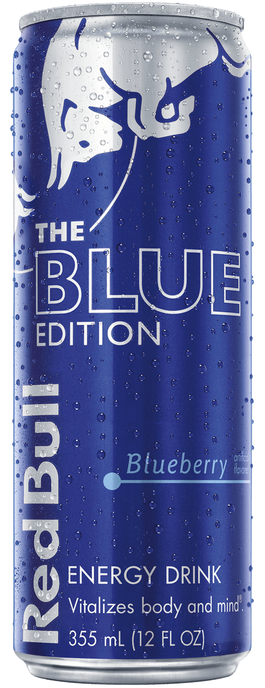
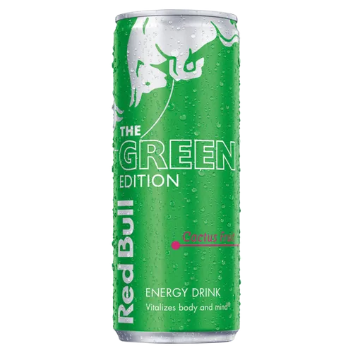
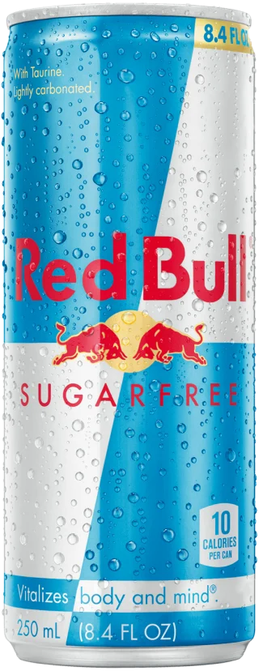

# Red Bull — Gives You Wingggs

<p align="center">
  
</p>

<p align="center">
  A premium, responsive Red Bull-inspired landing page with an auto-playing flavor carousel, motion effects, and a Vercel-ready static setup.
</p>

<p align="center">
  <a href="#features">Features</a> ·
  <a href="#preview">Preview</a> ·
  <a href="#run-locally">Run locally</a> ·
  <a href="#deploy-to-vercel">Deploy</a>
</p>

## Features

- Auto-playing Swiper flavor carousel with pause-on-hover
- Previous/next controls, clickable pagination, and keyboard navigation
- Dynamic flavor label and slide progress indicator
- Scroll reveal animation using `IntersectionObserver`
- Lightweight parallax movement while scrolling
- Responsive mobile navigation
- Hover states for navigation, CTA, social links, and product cans
- Accessible labels, alt text, and focus-visible controls
- Static deployment configuration for Vercel
- No framework or build step required

## Preview

### Flavor collection

<p align="center">
  
  
  
  
</p>

### More editions

<p align="center">
  
  
  
  
</p>


##Features
1. The carousel auto-advancing between flavors.
2. Hover pause and the previous/next controls.
3. Scroll reveal and parallax motion.
4. The responsive mobile navigation.

## Run locally

This is a static website. Open `index.html` directly, or use a local server:

```bash
npx http-server . -p 5500
```

Then open [http://localhost:5500](http://localhost:5500).

## Deploy to Vercel

1. Import this repository into Vercel.
2. Keep the framework preset as **Other**.
3. Leave the build command empty.
4. Set the output directory to `.`.
5. Deploy.

The included [`vercel.json`](./vercel.json) configures clean static rewrites.

## Project structure

```text
.
├── index.html       # Page structure and carousel markup
├── style.css        # Responsive visual system and animations
├── script.js        # Carousel, autoplay, scroll, and menu behavior
├── pics/            # Product and brand imagery
└── vercel.json      # Static Vercel deployment config
```

## Tech stack

- HTML5
- CSS3
- Vanilla JavaScript
- [Swiper](https://swiperjs.com/)
- Vercel static hosting

## License

This project is a fan-made front-end concept for educational and portfolio purposes. Red Bull trademarks and product imagery belong to their respective owners.
